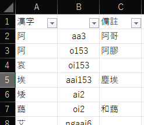
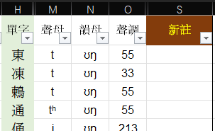
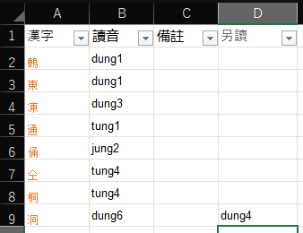
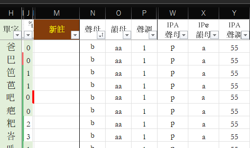

# 架撐

## 通表用架撐

### 使用 `main.py`

`main.py` 用來轉換字表到數據庫格式

`python main.py -i 字表路径 -l 地名 -n 表名 -c 字頭列 -p 粵拼列 -P 粵拼次音列 -I 音標列 -m 釋義列`

只有 `-i` 同 `-c` 必填，`-p`、`-I` 任一必填，`-l`、`-n` 依情況可省

`-n` 默認 `主表` 即調搽表樣式

`-l` 在字表文件名爲「地名(空格)(隨便什麼東西).xlsx」時可省

#### 例

`python main.py -i "順德大良 211021.xlsx" -c A -p B -m C -l 順德`

`python main.py -i "中山石歧 230915.xlsx" -c H -I MNO -m S`

`python main.py -i "桂平 220525.xlsx" -c A -p B -m C -P D`

`python main.py -i "江門白話 230910.xlsx" -c H -p NOP -m M -I WXY`

*列號超過 Z 的，自行解決*

導出得一個 .sql 文件，然後登入服務器數據庫，在 jyutdict 庫內 import 便是

### 配置音系 jgzw 數據

上面 IPA 與 J++ 之間的轉換、IPA 及 J++ 的後處理、聲調轉換的數據放在 `rules` 文件夾下

- `rule_j2i.csv`: 將 J++ 轉到 IPA
- `rule_i2j.csv`: 將 IPA 轉到 J++
- `rule_j2j.csv`: 修改 J++，應用在 j2i 之後
- `rule_i2i.csv`: 修改 IPA，應用在 i2j 之後
- `rule_tone_j2i.yaml`: 將 J++ 調號轉爲 IPA 調值
- `rule_tone_j2j.yaml`: 修改 J++ 調號，應用在 `tone_j2i` 之前

#### 前四個：音節轉換

音節轉換每行記錄一個轉換規則，形如`化州,*,e,*,*,e̯ɛ,*`、`鬱林,z,e,,*,ⁱᴇ,*`、`蒙山,*,o,t|n,*,ɔª,*`、`1,kʰ,uɐi,*,kʷʰ,ɐi,*」`，表示「規則名,轉換前聲母,轉換前韻*核*,轉換前韻*尾*,轉換後聲母,轉換後韻*核*,轉換後韻*尾*,」

「規則名」用於標記一套規則。上面命令行在默認情況下「`-l XX`」可以引用規則名「XX」「0」「1」三套規則

規則內，「*」指匹配所有，「|」可匹配多項。`化州,*,e,,*,e̯ɛ,*` 指將「…e…」轉換爲「…e̯ɛ…」；`鬱林,z,e,,*,ⁱᴇ,*` 指將「ze」轉換爲「…ⁱᴇ…」；`蒙山,*,o,t|n,*,ɔª,*` 指將「…o(t/n)」轉換爲「…ɔª…」。有順序，見 `rule_j2i.csv` 高州幾行

#### 後二個：聲調轉換

懶得寫了，自己打開看

### `test.py`

測試 jgzw 用的。例: `python test.py -i hai1 -l 廣州`

## 粵表用架撐

使 `sub_proj\PSheet\PanJSheet2Sql.py`

從 google 下載到泛粵表，在上面 python 腳本開頭改 `input_path` 同 `output_dir`，再 `python 佢` 得到三個 .sql 文件

然後按照 `手動屏蔽.yaml` 用 `Ctrl+H` 人工替換掉兩個 `JFaamjyut`

最後入服務器 jyutdict 庫，刪掉同名即 `IFaamjyut` `JFaamjyut` 兩張表，再 import 上面三個文件
